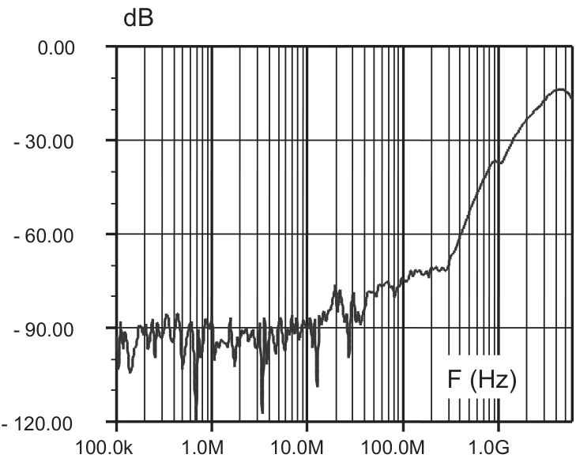

**Figure 12. Analog crosstalk results** 

<!-- Start of picture text -->
dB 0.00 - 30.00 - 60.00 - 90.00 F (Hz) - 120.00 100.0k 1.0M 10.0M 100.0M 1.0G <!-- End of picture text -->

As the USBLC6-2 is designed to protect high speed data lines, it must ensure a good transmission of operating signals. The frequency response (Figure 4. Frequency response) gives attenuation information and shows that the USBLC6-2 is well suitable for data line transmission up to 480 Mbit/s while it works as a filter for undesirable signals like GSM (900 MHz) frequencies, for instance. 

