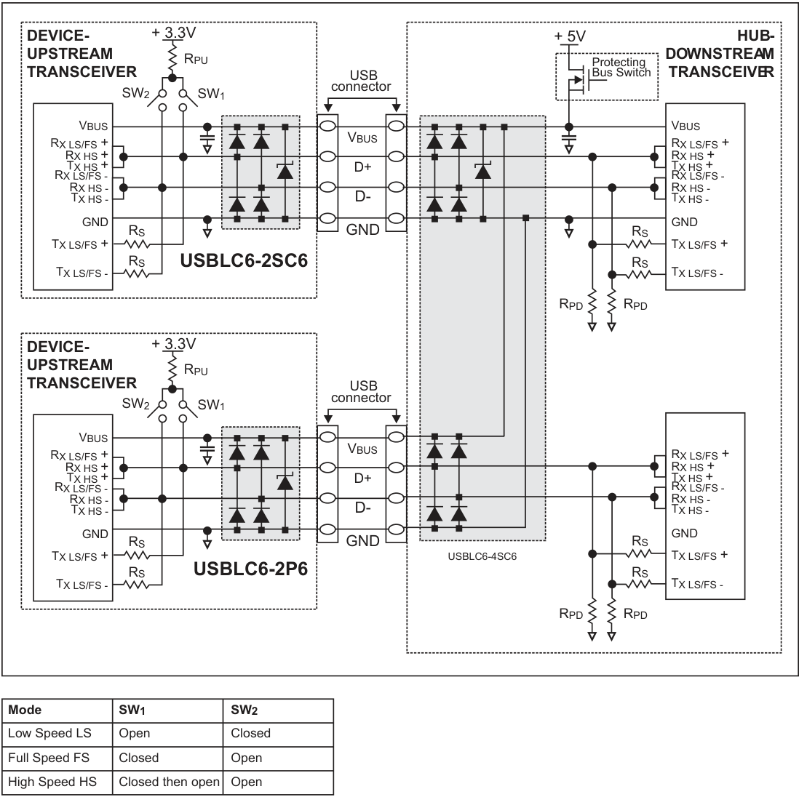

## **2.5 Application examples** 

#### **Figure 13. USB 2.0 port application diagram using USBLC6-2** 

<!-- Start of picture text -->
DEVICE- + 3.3V + 5V HUB- UPSTREAM RPU Protecting DOWNSTREAM TRANSCEIVER USB Bus Switch TRANSCEIVER SW2 SW1 connector VBUS VBUS RX LS/FS + VBUS RX LS/FS + RX HS + RX HS + TX HS + D+ TX HS + RX LS/FS - RX LS/FS - RTX HS -X HS - D- RTX HS -X HS - GND GND RS GND RS TX LS/FS + TX LS/FS + RS USBLC6-2SC6 RS TX LS/FS - TX LS/FS - RPD RPD DEVICE- + 3.3V UPSTREAM RPU TRANSCEIVER USB SW2 SW1 connector VBUS RX LS/FS + VBUS RX LS/FS + RX HS + RX HS + TX HS + D+ TX HS + RX LS/FS - RX LS/FS - RTX HS -X HS - D- RTX HS -X HS - GND GND RS GND RS TX LS/FS + USBLC6-4SC6 TX LS/FS + RS USBLC6-2P6 RS TX LS/FS - TX LS/FS - RPD RPD Mode SW1 SW2 Low Speed LS Open Closed Full Speed FS Closed Open High Speed HS Closed then open Open <!-- End of picture text -->

