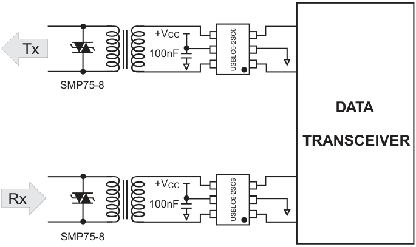
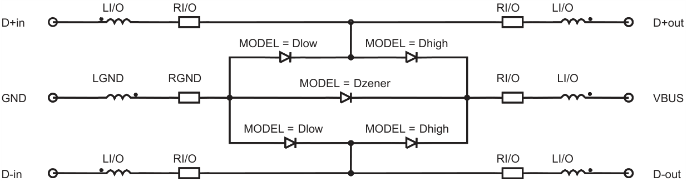

**Figure 14. T1/E1/Ethernet protection** 

<!-- Start of picture text -->
+VCC Tx 100nF SMP75-8 DATA TRANSCEIVER +VCC Rx 100nF SMP75-8 USBLC6-2SC6 USBLC6-2SC6 <!-- End of picture text -->

## **2.6** 

## **PSpice model** 

Figure 15. PSpice model shows the PSpice model of one USBLC6-2 cell. In this model, the diodes are defined by the PSpice parameters given in Figure 16. PSpice parameters. 

**Figure 15. PSpice model** 

<!-- Start of picture text -->
LI/O RI/O RI/O LI/O D+in D+out MODEL = Dlow MODEL = Dhigh LGND RGND RI/O LI/O MODEL = Dzener GND VBUS MODEL = Dlow MODEL = Dhigh LI/O RI/O RI/O LI/O D-in D-out <!-- End of picture text -->

_Note:_ 

_This simulation model is available only for an ambient temperature of 27 °C._ 

