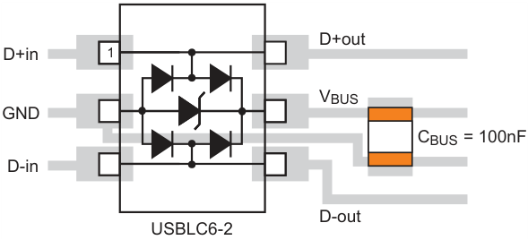

**Figure 16. PSpice parameters** 

**Figure 17. USBLC6-2 PCB layout considerations** 

<!-- Start of picture text -->
D+out D+in 1 VBUS GND CBUS = 100nF D-in D-out USBLC6-2 <!-- End of picture text -->

## Structured tables

- [Table 1](../tables/page-11-table-1.yaml)
