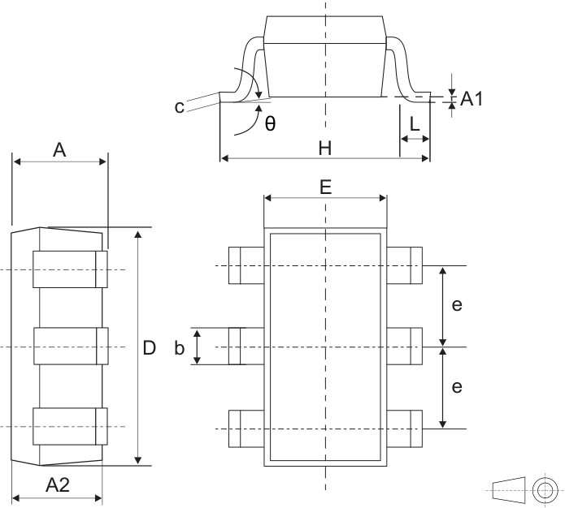

# **3 Package information** 

In order to meet environmental requirements, ST offers these devices in different grades of ECOPACK packages, depending on their level of environmental compliance. ECOPACK specifications, grade definitions and product status are available at: www.st.com. ECOPACK is an ST trademark. 

## **3.1 SOT23-6L package information** 

**Figure 18. SOT23-6L package outline** 

<!-- Start of picture text -->
A1 c θ L A H E e D b e A2 <!-- End of picture text -->

**Table 3. SOT23-6L package mechanical data** 

_1. Value in inches are converted from mm and rounded to 4 decimal digits_

## Structured tables

- [Table 3. SOT23-6L package mechanical data](../tables/page-12-table-3-sot23-6l-package-mechanical-data.yaml)
