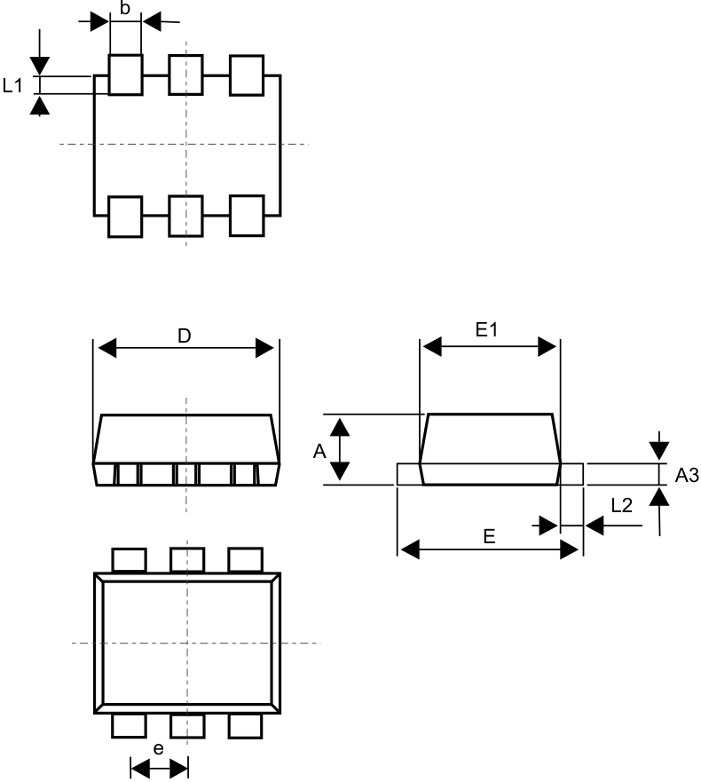

## **3.2 SOT-666 package information** 

#### **Figure 20. SOT-666 package outline** 

<!-- Start of picture text -->
b L1 D E1 A A3 L2 E e <!-- End of picture text -->

**Table 4. SOT-666 package mechanical data** 

_1. Value in inches are converted from mm and rounded to 4 decimal digits_

## Structured tables

- [Table 4. SOT-666 package mechanical data](../tables/page-14-table-4-sot-666-package-mechanical-data.yaml)
