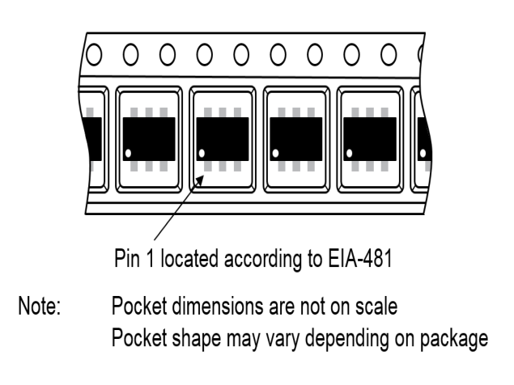
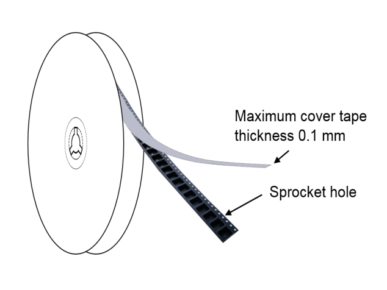
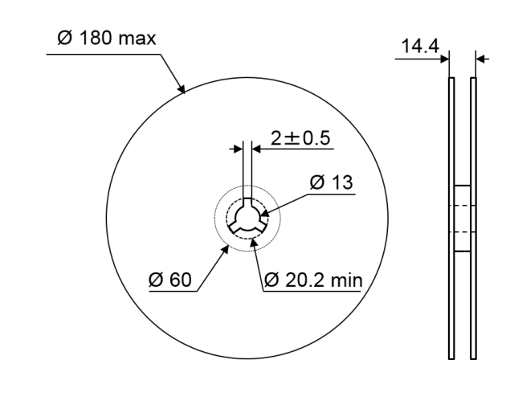
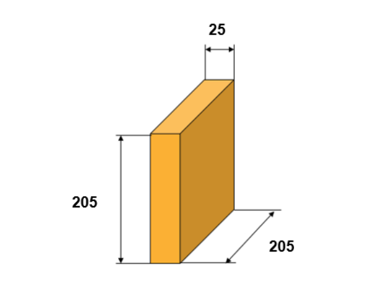

## **3.3 Packing information** 

**Figure 22. Marking layout (refer to ordering information table for marking)** X   X   X   X 

**Figure 23. Package orientation in reel** 

**Figure 24. Tape and reel orientation** 

**Figure 25. Reel dimensions (mm)** 

**Figure 26.  Inner box dimensions (mm)** 

