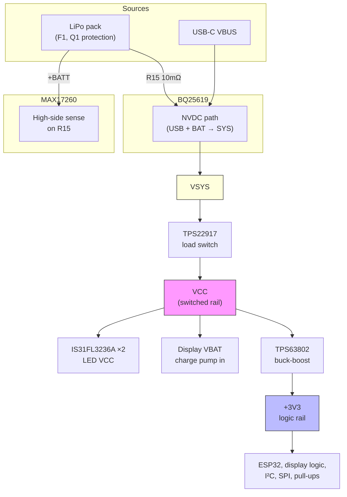

# Design Decisions

> Working notes for schematic reviewers. Sourced from design conversations (Aug 2026).
> Describes *why*, not a repeat of the netlist.

**Project:** `pdn-kit-hardware` — 1S LiPo ESP32-S3 handheld (PDN kit)

## Power topology

**Reading the diagram:** Pack current reaches the system only through the BQ25619 NVDC path. The load switch sits on `VSYS` so we can kill standby current on the high-power peripherals that must run from pack voltage, not from `+3V3`.

---

## POWER SHEET

### USB-IN

- USB 2.0 only — ESP32-S3 native USB-JTAG. No USB-c PD.
- `USBLC6` ESD protection on data lines.
- `PRTR5` on CC because USBLC6 does not cover CC; we wanted low-cap ESD on the negotiation lines, not ad-hoc Zeners.
- CC **5.1 kΩ pulldowns** (`R1`, `R2`) declare a USB-C sink so hosts deliver VBUS predictably.

### BATTERY

- PPTC in series — PCM is in the cells; fuse adds another fault boundary and is resettable.
- P-FET reverse-polarity block — protects the whole board on wrong pack insert with indicator LED.
- Pack temperature for **charging** is owned by the BQ `TS` network (not duplicated on the gauge).
- **NTC harness** — thermistor lives in a separate module taped to the pack, not on the PCB. Board needs a **connector** for that harness (replace schematic `NTC1` placeholder with the real connector + pinout). Divider values (`R10` 5.36 kΩ, `R9` 31.6 kΩ) target the BQ JEITA network for a 103AT-class NTC.

### BQ25619

- NVDC charger chosen so USB and battery merge onto one system rail and the device can run while charging.
- Shared 10 mΩ sense with MAX17260 — one shunt, one layout, both ICs read the same current.
- `PSEL` **strapped LOW (GND)** — LOW = **2.4 A** adapter/charging-port assumption; HIGH would mean **500 mA** USB SDP.
- `PMID` **— C3 + C4 (2× 10 µF) + C5 (1 nF) to GND** — PMID is the internal buck input node (`VBUS` → internal Q1 → PMID → chopper), required even with boost/OTG disabled; it is not an optional boost output.
  - TI pin table calls for **2× 4.7 µF + 1 nF**; layout §10.1 adds the **1 nF (0402)** at the PMID pin for HF switching noise and EMI.
  - Recommended minimum **CPMID = 10 µF**; we use **~20 µF bulk** (two 10 µF parts) for extra ripple margin during buck operation and to **consolidate BOM** with the other 10 µF BQ rails (`SYS`, `BAT`, `VBUS` bulk).
- `INT` — open-drain alert to ESP32 `IO7` with **10 kΩ pull-up to** `+3V3` (`R5`). Separate from I²C; edge-driven firmware path.
- **QON on** `PWR_OFF` **net** — button shares QON (~1 s ship exit on battery) and `IO5` (press timing). **Firmware policy:** `BATFET_RST_EN = 0` at boot; normal off via TPS22917; ship via I²C `BATFET_DIS`; ~30 s hold = factory reset (graceful shutdown → NVM wipe → `REG_RST` / ship while still powered). `IO5` is **input-only** with external pull-up.

### MAX17260

- Chosen over MAX17055 for **high-side sensing on a single shared shunt** — simpler pack wiring (no ground-referenced sense split) and cleaner integration with the BQ BAT node.
- Gauge does not own pack temperature; BQ JEITA path owns that. Can we tie into the existing NTC for the BQ here to give the max temp sensing as well? or does it not work like that?

### TPS22917

**Why the switch sits on** `VSYS` **before the TPS63802, not after it:**

LED drivers and the OLED charge-pump input need **~3.5–4.2 V** on their high-side supplies. Green/blue channels do not get enough compliance voltage from `+3V3`. Feeding them from the buck-boost would mean either a dedicated 5 V boost (explicitly rejected) or marginal brightness. Those loads sit on `VCC`, which tracks pack voltage through `VSYS`.

The problem: IS31 drivers, display pump, and their passives draw meaningful current even when the user thinks the device is off. Without a switch on `VSYS`, those loads stay biased from the battery path 24/7.

**What the switch buys us:** One high-side cut on `VSYS → VCC` removes standby leakage from:

- Two IS31FL3236A domains (LED anodes + driver IC)
- SSD1315 internal charge pump input (`VBAT` pin)
- TPS63802 input (and therefore the entire `+3V3` tree)

A switch placed **after** the TPS63802 would still leave the LED and display high-voltage domains powered from `VCC`/`VSYS`.

Short press + `PWR_HOLD` = user power latch. `PWR_OFF` = shutdown / long-press timing (see BQ section).

**Load budget:**

| Load on `VCC`        | Assumption                               | Current                    |
| -------------------- | ---------------------------------------- | -------------------------- |
| LEDs peak            | 57 ch × 10 mA (`REXT` cap)               | **302 mA**                 |
| LEDs typical         | ~25–35% PWM, mixed colors                | **~150–200 mA**            |
| OLED pump            | Datasheet 100% on, internal CP           | **~27 mA typ** (32 mA max) |
| TPS63802 input       | ESP32 + logic ~150 mA out @ ~90% eff     | **~170 mA**                |
| **Typical total**    | gameplay                                 | **~400 mA**                |
| **Worst-case total** | full-white LEDs + display + radio active | **~700 mA**                |

TPS22917DBVR is rated **2 A** continuous — headroom exists, but `VSYS` bulk and soft-start (`CT` cap) matter at turn-on because `VCC` dumps into LED/display input caps.

### TPS63802

- Buck-boost only where fixed 3.3 V is actually required (MCU, digital I/O, display logic).
- Sits **after** the load switch so `+3V3` drops when the user powers off — no ESP32 quiescent on a live regulator input.

### POWER-GPIO

| Net                   | GPIO        | Pull / strap on schematic                                                                                                                                    | Role                                                 |
| --------------------- | ----------- | ------------------------------------------------------------------------------------------------------------------------------------------------------------ | ---------------------------------------------------- |
| `I2C_SCL` / `I2C_SDA` | IO2 / IO1   | **4.7 kΩ pull-up to** `+3V3` at power end (`R8` / `R7`) **and** brain end (`R28` / `R27`) → **~2.35 kΩ effective** per line (split pull-ups b/c ~150 mm bus) | Shared PMIC, gauge, LED drivers                      |
| `INT`                 | IO7         | **10 kΩ pull-up to** `+3V3` (`R5`)                                                                                                                           | BQ fault/charge — **not** I²C                        |
| `MAX_ALRT`            | IO8         | **100 kΩ pull-up to** `+3V3` (`R18`)                                                                                                                         | Gauge alerts                                         |
| `CE`                  | IO6         | **10 kΩ pull-down to GND** (`R11`) — charge **enabled** when `CE` low / MCU idle                                                                             | Firmware override of charge enable                   |
| `PWR_HOLD`            | IO4         | **No pull resistor**; **1 kΩ** (`R16`) to Schottky `D2` → TPS22917 `ON`                                                                                      | Software power on latch.                             |
| `PWR_OFF`             | IO5         | **10 kΩ pull-up to** `+3V3` (`R17`); **input-only** in firmware                                                                                              | Software off & Factory Reset (Shared with QON on BQ) |
| `D+` / `D-`           | IO20 / IO19 | Through `USBLC6` (no discrete D+/D- pull-ups on ESP32 pins)                                                                                                  | Native USB                                           |

---

## LED SHEET

### DISPLAY LEDS (U5)

- Second IS31 vs one matrix driver — only 19 led's, don't need a full matrix setup.
- All 36 channels used — 12× RGB display - will be laid out as tall 6x2 grid; one driver IC per physical cluster simplifies PCB fanout.
- `VCC` feed (not `+3V3`) — voltage headroom for blue/green; see TPS22917 section.

### GRIP LEDS (U7)

- Second IC with distinct I²C address — 7× RGB (21 ch); spare channels unused.
- Same supply and current policy as display driver.

### LED-GPIO

- `LED_OFF` (`IO13`) → both driver `SDB` pins — one GPIO kills both drivers in hardware when sleeping lights without I²C traffic.
- `100 kΩ pull-down to GND` (`R3`) on `LED_OFF` / `SDB` — drivers stay in shutdown until firmware drives `SDB` high.

Driver + LED choice: 2× IS31FL3236A, common-anode RGB, ~10 mA/channel cap.

---

## UI SHEET

### MOTOR

- Haptics on a dedicated GPIO + transistor — keep motor current off the MCU pin.

### BUTTONS

- `SW1`/`SW3` are game/UI inputs.

### DISPLAY (U9)

- SSD1315 Wisevision module — charge-pump mode from `VCC`, logic from `+3V3`.
- Skipping the power switch circuit in favor of software shutdown.

### UI-GPIO

SPI + button GPIOs — standard panel hookup; display control stays on brain hierarchical nets.

---

## BRAIN

### ESP32-S3

- WROOM module, N8R8 so have to watch out for Octal SPI on 38-42.
- **Boot strap:** `IO0` **10 kΩ pull-up to** `+3V3` (`R36`).

### JACKS

- Dual 3.5 mm jacks — serial-over-audio physical layer for PDN chain/duel linking (firmware RDC).
- Tip and first ring for Serial, R2 and R3 are for connection detection, and the sleeve is ground.
- SRV05 per jack — ESD on exposed tip/ring pins; nearly identical schematic blocks, direction assigned in firmware.

